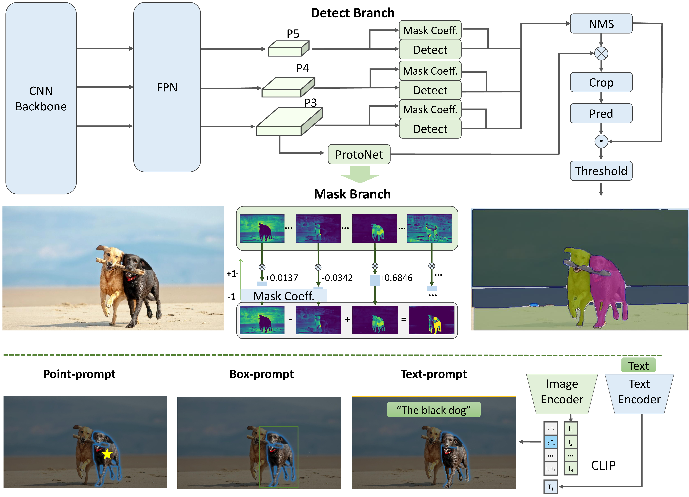

# Fast Segment Anything

[[`📕Paper`](https://arxiv.org/pdf/2306.12156.pdf)] [[`🤗HuggingFace Demo`](https://huggingface.co/spaces/An-619/FastSAM)] [[`Colab demo`](https://colab.research.google.com/drive/1oX14f6IneGGw612WgVlAiy91UHwFAvr9?usp=sharing)] [[`Replicate demo & API`](https://replicate.com/casia-iva-lab/fastsam)] [[`Model Zoo`](#model-checkpoints)] [[`BibTeX`](#citing-fastsam)]


The **Fast Segment Anything Model(FastSAM)** is a CNN Segment Anything Model trained by only 2% of the SA-1B dataset published by SAM authors. The FastSAM achieve a comparable performance with
the SAM method at **50× higher run-time speed**.



**🍇 Refer from**
https://github.com/CASIA-IVA-Lab/FastSAM
[[`Original`]((https://github.com/CASIA-IVA-Lab/FastSAM)]

## Export ONNX
```
    # You can re-config pt2onnx.sh
    bash pt2onnx.sh
    or
    python pt2onnx.py
```

## INFER ONNX
```
    python infer_onnx.py
```


## TensorRT (You can deploy on Triton Server by tensort plan)
```
    bash onnx2trt.sh
    python inference_trt.py
```


